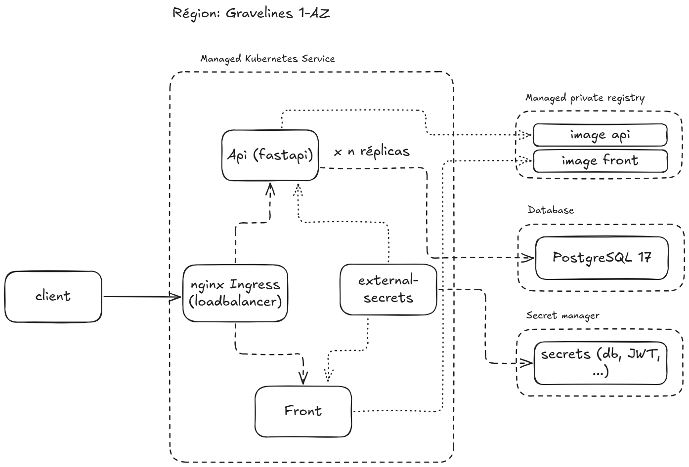

# Explication déploiement (partie 2)

 

Pour l'architecture de déploiement, chez OVH Cloud hébergé en France, on peut déployer notre application (api et front) dans un cluster Kubernetes via le Managed Kubernetes Service qui permet une bonne scalabilité (horizontale et verticale) et une gestion des secrets couplée avec le service Secret Manager de OVH. On utilise un Load Balancer pour répartir la charge (avec nginx pour reverse proxy). Les images sont stockées dans le Managed Private Registry d'OVH. Et les données (utilisateur et checkpointer langgraph) sont stockées dans une base de données PostgreSQL 17.

Spécification:
* région: Gravelines 1-az
* Managed Kubernetes Service: service: Gratuit, noeud: 3x B3-8 (2vcore, 8Go RAM) 101.846/mois (possibilité de passer en région Paris 3-az pour avoir notre cluster répliqué + 65.70€/mois + prix noeud x nb_cluster)
* Database: PostgreSQL 17 production noeud:B3-8 (2vcore, 8Go RAM) prix: ~325€/mois
* Managed private registry: ~19.05€/mois
* Secret manager: 3 secrets: prix: 3 x 0.03€/mois = 0.09€/mois
* Load Balancer: taille M, prix: ~ 15.184€/mois
* GateWay: Taille S, prix: ~2.044€/mois
* IP floating: prix: 1.8€/mois

Total: ~ 465,464€/mois

Pour le LLM utilisé, on ne peut pas utiliser arcee-ai/trinity-large-preview:free, qui est pour le dev seulement et pas hébergé en Europe. Il y a plusieurs alternatives possibles : Si on n'a pas besoin d'une certification HDS pour les appels API (en UE) : on peut partir sur Mistral Large 3. Si on doit rester en France avec la certification HDS : on peut partir sur de l'auto-hébergement chez OVHcloud (AI Deploy) de Qwen3-235B NVFP4 sur 4x L40s (limité à des noeuds de 4 GPU) ou chez Scaleway (moins cher en général et max 8 GPU/noeud). Ce qui reste le plus économique sans quitter l'Europe reste l'API de Mistral mais hébergée chez Azure (acteur Américain) en Europe.